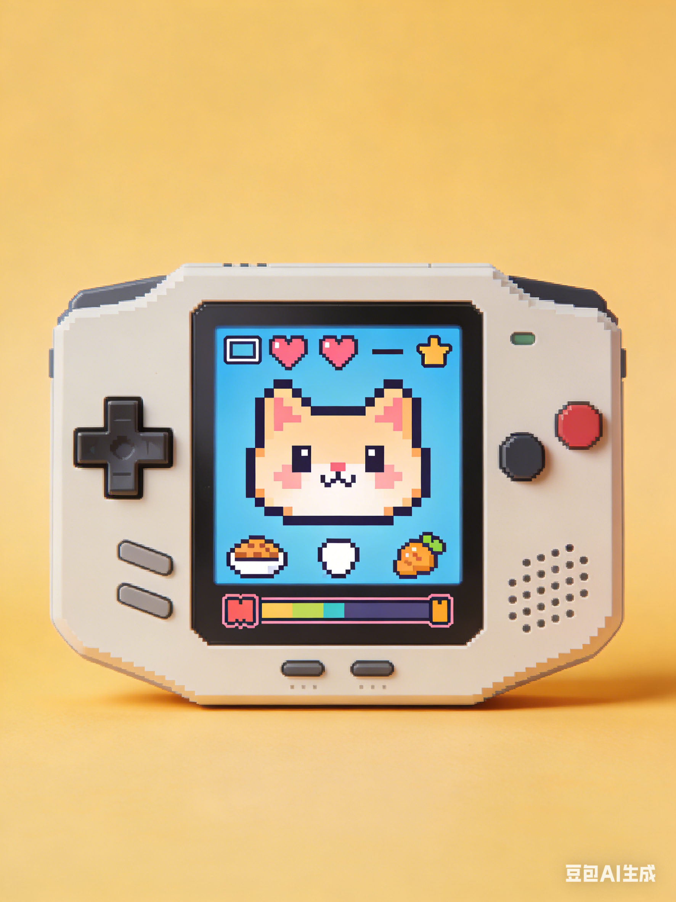

# 🤖 PetBot - AI电子宠物需求文档

## 📋 产品概念单页

### 产品名称
**PetBot** | 代号：Project Tamagotchi+

### 一句话Slogan
**"用AI养一只不需要铲屎的电子宠物"**

### 用户痛点
- **宿舍禁宠**：95%高校宿舍禁止饲养真宠物，学生陪伴需求无法满足
- **云撸猫不过瘾**：看别人宠物视频无法解决"被需要"的情感诉求
- **电子宠物太智障**：市售电子宠物互动模式固化，几天就腻
- **孤独感真实存在**：期末季、深夜赶due时的情绪陪伴缺失

### 解决方案
**一个搭载树莓派的AI驱动电子宠物，具备以下核心功能：**

| 功能 | 描述 | 技术实现 |
|------|------|----------|
| 🎭 **人脸识别认主** | 只认主人的脸，陌生人靠近会害羞/警惕 | OpenCV + 本地训练模型 |
| 💬 **语音对话** | 能和主人简单聊天，记住对话内容 | 本地轻量级LLM + 麦克风 |
| 😊 **情绪系统** | 根据互动方式变换表情和反应 | 状态机 + 表情动画引擎 |
| 🍖 **虚拟喂养** | 扫码/点击喂食，影响宠物成长 | Pygame动画 + 状态记录 |
| 📈 **进化机制** | 互动越多，宠物形态越丰富 | 经验值系统 + 模型切换 |
| 📊 **互动日报** | 每天生成"宠物日记" | 数据统计 + AI生成文案 |

### AI参与度明细

| 模块 | AI生成内容 | Prompt截图保存路径 |
|------|------------|-------------------|
| 人脸识别 | OpenCV训练代码、人脸注册逻辑 | `/prompts/face_recognition.md` |
| 情绪状态机 | 状态转换逻辑、情绪参数设计 | `/prompts/emotion_fsm.md` |
| 宠物外观 | 3D/像素风宠物素材（多形态） | `/prompts/pet_design.md` |
| 对话逻辑 | 本地小模型调用代码、对话管理 | `/prompts/dialogue.md` |
| 硬件接线 | 树莓派引脚配置、传感器选型 | `/prompts/hardware.md` |
| 互动日报 | 每日总结文案生成prompt | `/prompts/daily_report.md` |

> ⚠️ **注意**：所有AI生成代码均需保留prompt和对话记录，作为交付物的一部分

---

## 🎨 可视化原型

### 概念图描述

**硬件外观：**
- 树莓派Zero W + 3.2寸TFT触摸屏（作为宠物"脸"）
- 摄像头（眼睛位置/额头）
- 小喇叭（嘴巴位置）
- 亚克力/3D打印外壳（拟人/拟动物造型）
- 可选：LED氛围灯（情绪颜色）

**软件界面：**
- 主屏：宠物表情（眨眼、开心、生气等）
- 左滑：互动记录（今天说了什么）
- 右滑：宠物状态（饱腹度、心情值、经验值）
- 上滑：喂食界面（虚拟食物选择）
- 下滑：设置（亮度、音量、认主人脸）

### AI生成效果图


 

---

## 🗓️ 开发路线图

| 周数 | 任务 | AI辅助点 |
|------|------|----------|
| Week 1 | 硬件采购+环境搭建 | 用AI生成采购清单+接线图 |
| Week 2 | 人脸识别+表情动画 | 用AI写OpenCV代码+Pygame动画 |
| Week 3 | 对话系统+状态机 | 用AI调优本地小模型+情绪逻辑 |
| Week 4 | 整机测试+One-Pager撰写 | 用AI生成文档+路演PPT大纲 |

---

## 🚀 技术栈详情

| 组件 | 技术选型 | 说明 |
|------|----------|------|
| 硬件 | 树莓派4B/Zero W | Zero W更省电，4B性能更强 |
| 屏幕 | 3.2寸TFT SPI接口 | 性价比高，刷新率够用 |
| 摄像头 | Pi Camera V2 | 官方支持好 |
| 音频 | 3W小喇叭+I2S功放 | 音质够用 |
| 人脸识别 | OpenCV + LBPH | 轻量级，可本地跑 |
| 动画引擎 | Pygame | 轻量，适合树莓派 |
| 对话模型 | TinyLLaMA/GPT4All | 本地运行，无需网络 |
| 状态管理 | Python + JSON | 轻量级状态机 |
| 外壳 | 3D打印/激光切割亚克力 | 可先用纸板原型 |

---

## 📁 交付物清单
```
PetBot/
├── README.md
├── PetBot_Requirements.md（本文件）
├── assets/
│ └── concept_*.png（AI生成概念图）
├── prompts/
│ ├── face_recognition.md
│ ├── emotion_fsm.md
│ ├── pet_design.md
│ ├── dialogue.md
│ ├── hardware.md
│ └── daily_report.md
├── src/
│ ├── main.py
│ ├── face_recognition.py
│ ├── emotion.py
│ ├── dialogue.py
│ └── ui/
└── recruitment/
└── mentor_profile.md
```
---

## 💡 项目亮点总结

- ✅ **真实痛点**：宿舍养宠禁令下的情感陪伴需求
- ✅ **技术可行**：全部使用成熟技术栈，AI辅助降低门槛
- ✅ **有故事性**：养成的宠物"只认你一个人"
- ✅ **可展示**：Open Day现场可以直接互动
- ✅ **有延展性**：未来可做多宠社交、宠物云继承等

---
